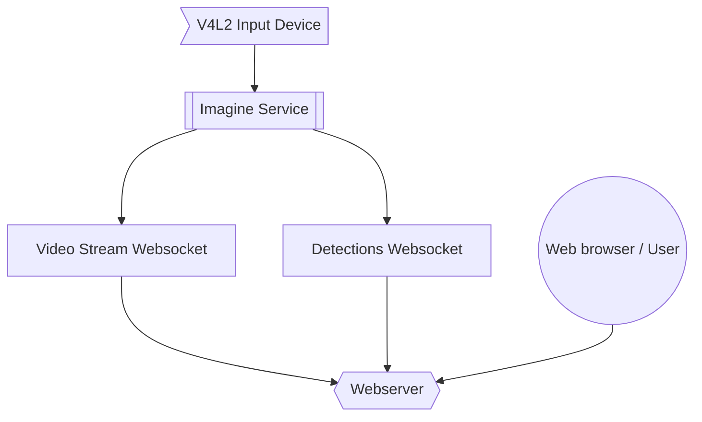

# Imagine Monitor

This is the primary detection service for imagine.



It pulls video frames from video

### Deploying

You can build an image using `docker build .`

#### Multi-arch images

docker buildx build --progress=plain --platform linux/arm64,linux/amd64 -t vontakach/imagine:latest --push .

### Notes

Multicast is used so we can process the video in different ways without having to encode it multiple times

* to consume multicast video in docker you need use the host network (or the multicast source must come from another container)
* docker on windows or mac will *NOT WORK* as they are virtualising linux and running in a bridged network
* WSL on windows will also not work as you can't run kernel modules such as V4L2 loopback devices

For loopback support

```shell
sudo apt-get install v4l2loopback-dkms

# create two loopback devices
sudo modprobe v4l2loopback devices=2

# to configure this to persist after a reboot
echo v4l2loopback | sudo tee -a /etc/modules-load.d/v4l2loopback.conf
echo "options v4l2loopback devices=2" | sudo tee -a /etc/modprobe.d/v4l2loopback.conf
```

For replay support, you'll need to have setup the ramdisk unless you want to run as root

```shell
sudo mkdir -p /mnt/ramdisk
sudo mount -t tmpfs -o size=512M tmpfs /mnt/ramdisk

export REPLAY_MOUNT_PATH=/mnt/ramdisk

# to configure this to persist after a reboot
echo "tmpfs       /mnt/ramdisk   tmpfs   size=512M   0  0" | sudo tee -a /etc/fstab

# can test this config with (unmount if ramdisk already mounted)
sudo umount /mnt/ramdisk
sudo mount -a
```

Launch imagine monitor

```shell
# What video input should be used
# can get this list of formats: v4l2-ctl -D --list-formats-ext --device /dev/video0
# we expect YUYV format
export INPUT_DEVICE=/dev/video0
export INPUT_WIDTH=640
export INPUT_HEIGHT=480

# What address should be used to stream the video on
export MULTICAST_ADDRESS=224.0.0.1
export MULTICAST_PORT=1234

# Enable the detection model
export MODEL_PATH="./tf-models/mobilenet_v3_small.tflite"
# Or specify a URI
export MODEL_URI=https://raw.githubusercontent.com/google-coral/test_data/master/efficientdet_lite0_320_ptq_edgetpu.tflite
export LABELS_URI=https://raw.githubusercontent.com/google-coral/test_data/master/coco_labels.txt

# Enable or disable certain features
export ENABLE_STREAMING=true
export ENABLE_DETECTOR=true
export ENABLE_EDGETPU=true
export ENABLE_REPLAY=true

# start the process
./bin/monitor
```

Then can watch the stream over

* Multicast `udp://@224.0.0.1:1234`
* Web Browser `http://<ip-address>:3000/mpegts.html`

### Generate Keys

If you would like to run local development over self signed HTTPS

```shell
openssl req -x509 -newkey rsa:4096 -keyout key.pem -out cert.pem -sha256 -days 365
openssl pkey -in key.pem -out cert.key
openssl crl2pkcs7 -nocrl -certfile cert.pem | openssl pkcs7 -print_certs -out cert.crt
rm *.pem
```

## Other notes

Currently running containers as root for access to Coral USB TPU hardware.
Need work out udev rules for enabling access to the user in the container.

```
echo 'SUBSYSTEM=="usb", ATTRS{idVendor}=="1a6e", ATTRS{idProduct}=="089a", MODE="0666", GROUP="plugdev"' | sudo tee /etc/udev/rules.d/65-coral-usb-accelerator.rules
echo 'SUBSYSTEM=="usb", ATTRS{idVendor}=="18d1", ATTRS{idProduct}=="9302", MODE="0666", GROUP="plugdev"' | sudo tee -a /etc/udev/rules.d/65-coral-usb-accelerator.rules
```

Something like this, outside and within the container.
(The product ID changes from `Global Unichip Corp` to `Google Inc`)
