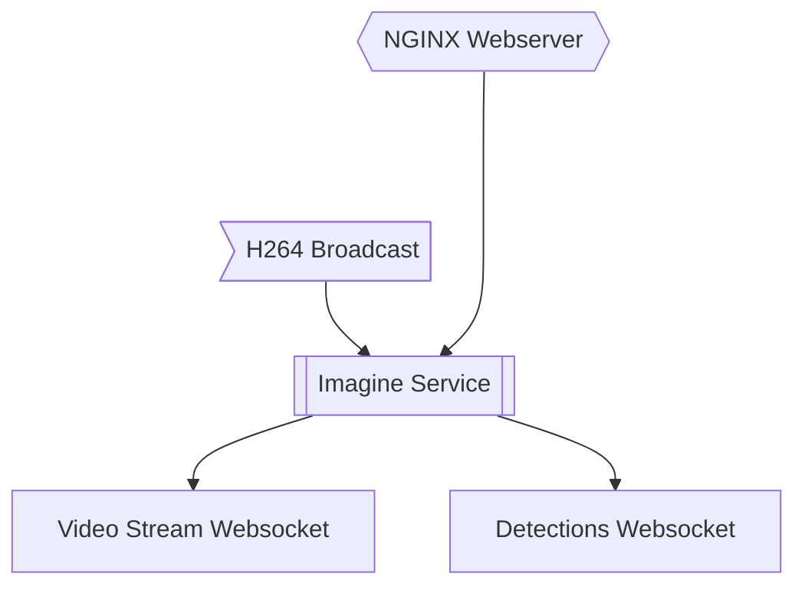

# Imagine Monitor

This is the primary detection service for imagine.

```mermaid
flowchart TD
    B>H264 Broadcast] --> I[[Imagine Service]]
    I --> V[Video Stream Websocket]
    I --> D[Detections Websocket]
    N{{NGINX Webserver}} ----> I
```

### Deploying

You can build an image using `docker build .`
