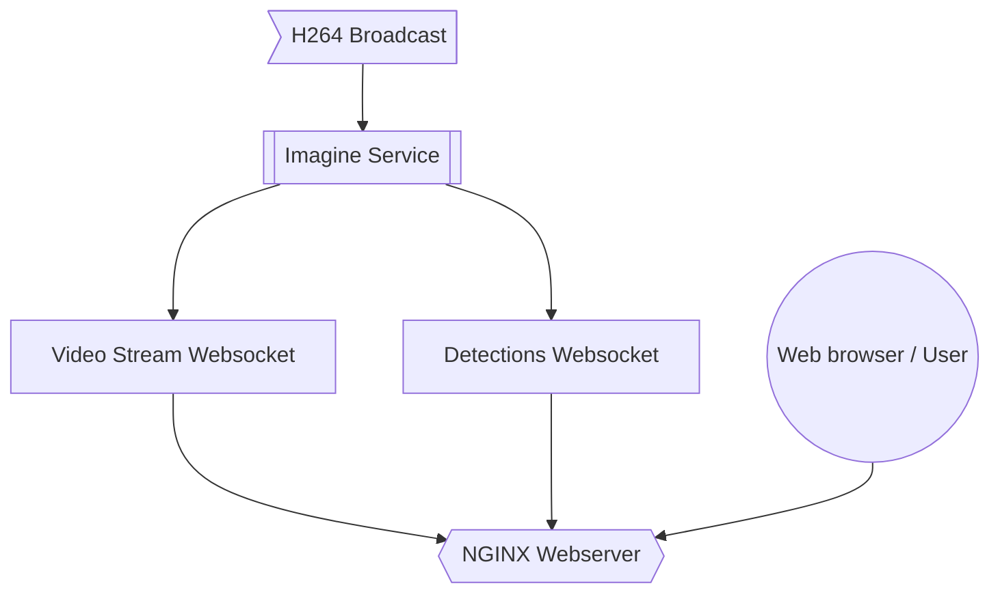

# Imagine Monitor

This is the primary detection service for imagine.



### Deploying

You can build an image using `docker build .`

#### Multi-arch images

docker buildx build --progress=plain --platform linux/arm64,linux/amd64 -t vontakach/imagine:latest --push .

### Notes

Multicast is used so we can process the video in different ways without having to encode it multiple times

* to consume multicast video in docker you need use the host network (or the multicast source must come from another container)
* docker on windows or mac will *NOT WORK* as they are virtualising linux and running in a bridged network
* WSL on windows will also not work. You can however run the code locally on mac.

Launch an example stream

```shell
ffmpeg -stream_loop -1 -i ./test.mp4 -f mpegts udp://224.0.0.1:1234

libcamera-vid -t 0 --inline --listen --width 2028 --height 1080 --codec h264 -n -o udp://224.0.0.1:1234
```

Launch imagine monitor

```shell
export MULTICAST_ADDRESS=224.0.0.1
export MULTICAST_PORT=1234

# Enable streaming of the video source for monitoring
export ENABLE_STREAMING=true

# Enable the detection model
export MODEL_PATH="./mobilenet_v3_small.tflite"
export ENABLE_DETECTOR=false

# start the process
./bin/monitor
```

Then can watch the stream over TCP on port in VLC using
`tcp/h264://<ip-address>:3002`

### Generate Keys

If you would like to run local development over self signed HTTPS

```shell
openssl req -x509 -newkey rsa:4096 -keyout key.pem -out cert.pem -sha256 -days 365
openssl pkey -in key.pem -out cert.key
openssl crl2pkcs7 -nocrl -certfile cert.pem | openssl pkcs7 -print_certs -out cert.crt
rm *.pem
```
